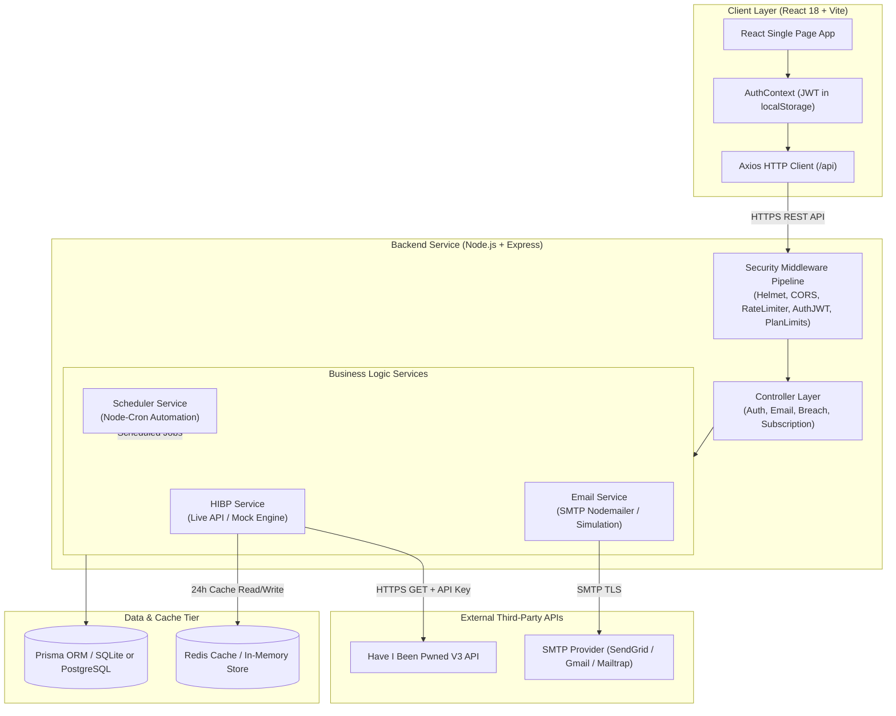
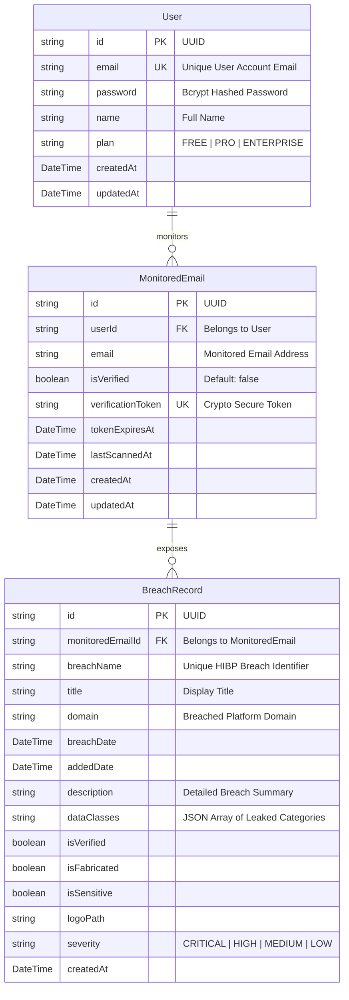

# 🛡️ BreachAlert: Personal Data Breach Monitoring & Security Alert System
## Comprehensive Technical Documentation & Architecture Specification

---

## 📋 Table of Contents
1. [Executive Summary & System Architecture](#1-executive-summary--system-architecture)
2. [Database Schema & Data Model (Prisma ORM)](#2-database-schema--data-model-prisma-orm)
3. [Backend Microservice Implementation (Node.js / Express)](#3-backend-microservice-implementation-nodejs--express)
   - 3.1 [Environment & Configuration Layer (`server/src/config/`)](#31-environment--configuration-layer)
   - 3.2 [Middleware Pipeline (`server/src/middleware/`)](#32-middleware-pipeline)
   - 3.3 [Controller Layer (`server/src/controllers/`)](#33-controller-layer)
   - 3.4 [Core Business Services (`server/src/services/`)](#34-core-business-services)
   - 3.5 [Server Entry & Static Asset Serving (`server/src/server.js`)](#35-server-entry--static-asset-serving)
4. [Frontend Application Architecture (React / Vite)](#4-frontend-application-architecture-react--vite)
   - 4.1 [API Communications Client (`client/src/services/api.js`)](#41-api-communications-client)
   - 4.2 [Authentication State Provider (`client/src/context/AuthContext.jsx`)](#42-authentication-state-provider)
   - 4.3 [Application Router & Root (`client/src/App.jsx`)](#43-application-router--root)
   - 4.4 [Page Views & Route Handlers (`client/src/pages/`)](#44-page-views--route-handlers)
   - 4.5 [Modular UI Component Library (`client/src/components/`)](#45-modular-ui-component-library)
5. [API Endpoint Specification & Contracts](#5-api-endpoint-specification--contracts)
6. [Security, Subscription Tiering & Rate Limiting Engine](#6-security-subscription-tiering--rate-limiting-engine)
7. [Deployment, Infrastructure & DevOps (Render & Docker)](#7-deployment-infrastructure--devops-render--docker)
8. [Setup, Installation & Execution Guide](#8-setup-installation--execution-guide)

---

## 1. Executive Summary & System Architecture

**BreachAlert** is a enterprise-grade, full-stack cybersecurity application designed to monitor personal email addresses against global data breach intelligence feeds (such as *Have I Been Pwned*). It alerts users in real-time when their credentials or sensitive personal identifiable information (PII) appear in known security incidents, data dumps, or dark web marketplaces.

### Key Capabilities:
- **Multi-Email Monitoring**: Users can register multiple email addresses and track their breach exposure.
- **Subscription Tiering**: Dynamic limits based on subscription plans (`FREE` tier: 2 emails, `PRO` tier: 10 emails, `ENTERPRISE` tier: 50 emails).
- **Automated Scanning & Background Jobs**: Scheduled cron engine runs continuous background audits on monitored accounts.
- **Real SMTP & Verification Flow**: Email verification tokens generated for identity confirmation, supported by Nodemailer with HTML templates and fallback mock transport modes.
- **Resilient Fallback Engines**: Dual-mode HIBP integration (Live API Key vs. Mock Engine with deterministic realistic breach generation) and Redis caching with in-memory fallback.
- **Unified Production Deployment**: Optimized for zero-config single-service container deployment on Render, serving the compiled React Vite SPA directly from Express.

### System Architecture Diagram



---

## 2. Database Schema & Data Model (Prisma ORM)

The data model is managed via **Prisma ORM** (`server/prisma/schema.prisma`), supporting lightweight SQLite for local/testing execution and seamless migration to PostgreSQL for cloud production deployment.

### Entity Relationship Diagram (ERD)



### Complete Schema Source (`server/prisma/schema.prisma`)

```prisma
// Prisma schema for BreachAlert Database (SQLite for zero-dependency local execution)

generator client {
  provider = "prisma-client-js"
}

datasource db {
  provider = "sqlite"
  url      = "file:./dev.db"
}

model User {
  id              String           @id @default(uuid())
  email           String           @unique
  password        String
  name            String
  plan            String           @default("FREE")
  createdAt       DateTime         @default(now())
  updatedAt       DateTime         @updatedAt
  monitoredEmails MonitoredEmail[]

  @@map("users")
}

model MonitoredEmail {
  id                String         @id @default(uuid())
  userId            String
  user              User           @relation(fields: [userId], references: [id], onDelete: Cascade)
  email             String
  isVerified        Boolean        @default(false)
  verificationToken String?        @unique
  tokenExpiresAt    DateTime?
  lastScannedAt     DateTime?
  createdAt         DateTime       @default(now())
  updatedAt         DateTime       @updatedAt
  breaches          BreachRecord[]

  @@unique([userId, email])
  @@map("monitored_emails")
}

model BreachRecord {
  id               String         @id @default(uuid())
  monitoredEmailId String
  monitoredEmail   MonitoredEmail @relation(fields: [monitoredEmailId], references: [id], onDelete: Cascade)
  breachName       String
  title            String
  domain           String?
  breachDate       DateTime?
  addedDate        DateTime?
  description      String
  dataClasses      String         @default("[]")
  isVerified       Boolean        @default(true)
  isFabricated     Boolean        @default(false)
  isSensitive      Boolean        @default(false)
  logoPath         String?
  severity         String         @default("MEDIUM")
  createdAt        DateTime       @default(now())

  @@unique([monitoredEmailId, breachName])
  @@map("breach_records")
}
```

---

## 3. Backend Microservice Implementation (Node.js / Express)

### 3.1 Environment & Configuration Layer (`server/src/config/`)

#### Environment Loader (`env.js`)
Validates environment parameters and defines default fallback configurations for Redis, JWT secrets, Nodemailer SMTP, and HIBP API keys.

```javascript
const path = require('path');
require('dotenv').config({ path: path.resolve(__dirname, '../../../.env') });

module.exports = {
  port: process.env.PORT || 5000,
  nodeEnv: process.env.NODE_ENV || 'development',
  jwtSecret: process.env.JWT_SECRET || 'dev_jwt_secret_change_in_production_12345',
  jwtExpiresIn: process.env.JWT_EXPIRES_IN || '7d',
  redisUrl: process.env.REDIS_URL || 'redis://localhost:6379',
  hibpApiKey: process.env.HIBP_API_KEY || 'mock',
  hibpUserAgent: process.env.HIBP_USER_AGENT || 'BreachAlert-Security-Monitor/1.0',
  clientUrl: process.env.CLIENT_URL || 'http://localhost:5173',
  smtp: {
    host: process.env.SMTP_HOST || 'smtp.mailtrap.io',
    port: parseInt(process.env.SMTP_PORT || '2525', 10),
    user: process.env.SMTP_USER || '',
    pass: process.env.SMTP_PASS || '',
  },
  emailFrom: process.env.EMAIL_FROM || 'no-reply@breachalert.io',
};
```

#### Redis Cache Client (`redis.js`)
Provides high-performance 24-hour caching for HIBP breach queries. Automatically falls back to an in-memory `Map` cache if a physical Redis server is unavailable.

---

### 3.2 Middleware Pipeline (`server/src/middleware/`)

#### JWT Auth Middleware (`authMiddleware.js`)
Extracts and validates `Authorization: Bearer <token>` HTTP headers.

```javascript
const jwt = require('jsonwebtoken');
const config = require('../config/env');

const authMiddleware = (req, res, next) => {
  const authHeader = req.headers.authorization;
  if (!authHeader || !authHeader.startsWith('Bearer ')) {
    return res.status(401).json({ success: false, error: 'Access denied. No token provided.' });
  }

  const token = authHeader.split(' ')[1];
  try {
    const decoded = jwt.verify(token, config.jwtSecret);
    req.user = decoded;
    next();
  } catch (error) {
    return res.status(401).json({ success: false, error: 'Invalid or expired token.' });
  }
};

module.exports = authMiddleware;
```

#### Subscription Plan Enforcement Middleware (`planMiddleware.js`)
Dynamically calculates monitored email counts and rejects additions exceeding subscription quotas.

```javascript
const prisma = require('../config/db');

const PLAN_LIMITS = {
  FREE: 2,
  PRO: 10,
  ENTERPRISE: 50,
};

const checkPlanLimit = async (req, res, next) => {
  try {
    const user = await prisma.user.findUnique({
      where: { id: req.user.id },
      include: { monitoredEmails: true },
    });

    if (!user) {
      return res.status(404).json({ success: false, error: 'User not found.' });
    }

    const currentCount = user.monitoredEmails.length;
    const limit = PLAN_LIMITS[user.plan] || PLAN_LIMITS.FREE;

    if (currentCount >= limit) {
      return res.status(403).json({
        success: false,
        error: `Plan limit reached. Your '${user.plan}' plan allows a maximum of ${limit} monitored email addresses.`,
        currentCount,
        limit,
        plan: user.plan,
      });
    }

    req.userPlan = user.plan;
    next();
  } catch (error) {
    next(error);
  }
};

module.exports = { checkPlanLimit, PLAN_LIMITS };
```

---

### 3.3 Controller Layer (`server/src/controllers/`)

#### Auth Controller (`authController.js`)
Handles user registration, login authentication, password hashing (`bcryptjs`), and plan detail retrieval.

```javascript
const bcrypt = require('bcryptjs');
const jwt = require('jsonwebtoken');
const prisma = require('../config/db');
const config = require('../config/env');

exports.register = async (req, res, next) => {
  try {
    const { name, email, password } = req.body;
    if (!name || !email || !password) {
      return res.status(400).json({ success: false, error: 'Please provide name, email, and password.' });
    }

    const existingUser = await prisma.user.findUnique({ where: { email: email.toLowerCase() } });
    if (existingUser) {
      return res.status(400).json({ success: false, error: 'User already exists with this email.' });
    }

    const salt = await bcrypt.genSalt(10);
    const hashedPassword = await bcrypt.hash(password, salt);

    const user = await prisma.user.create({
      data: { name, email: email.toLowerCase(), password: hashedPassword, plan: 'FREE' },
    });

    const token = jwt.sign({ id: user.id, email: user.email }, config.jwtSecret, { expiresIn: config.jwtExpiresIn });

    res.status(201).json({
      success: true,
      token,
      user: { id: user.id, name: user.name, email: user.email, plan: user.plan },
    });
  } catch (error) {
    next(error);
  }
};
```

---

### 3.4 Core Business Services (`server/src/services/`)

#### Have I Been Pwned (HIBP) Service (`hibpService.js`)
Implements severity heuristics calculation (`CRITICAL`, `HIGH`, `MEDIUM`, `LOW`), Redis caching, rate limiting (429 handling), and a deterministic Mock engine for offline/test environments.

```javascript
function calculateSeverity(dataClasses = []) {
  const classesUpper = dataClasses.map((c) => c.toUpperCase());
  const criticalKeys = ['PASSWORDS', 'CREDIT CARDS', 'BANK ACCOUNT DETAILS', 'SOCIAL SECURITY NUMBERS', 'BIOMETRIC DATA', 'PIN'];
  const highKeys = ['PASSWORD HASHES', 'AUTH TOKENS', 'SECURITY QUESTIONS', 'PASSPORT NUMBERS', 'DRIVERS LICENSE NUMBERS'];
  const mediumKeys = ['PHONE NUMBERS', 'IP ADDRESSES', 'DATES OF BIRTH', 'PHYSICAL ADDRESSES', 'USERNAMES'];

  if (classesUpper.some((item) => criticalKeys.some((k) => item.includes(k)))) return 'CRITICAL';
  if (classesUpper.some((item) => highKeys.some((k) => item.includes(k)))) return 'HIGH';
  if (classesUpper.some((item) => mediumKeys.some((k) => item.includes(k)))) return 'MEDIUM';
  return 'LOW';
}
```

---

### 3.5 Server Entry & Static Asset Serving (`server/src/server.js`)

Main Express bootstrap script that configures Helmet security headers, CORS origins, route registration, background cron scheduler initialization, and candidate static path lookup for single-container deployment.

```javascript
const candidatePaths = [
  path.resolve(__dirname, '../../client/dist'),
  path.resolve(process.cwd(), 'client/dist'),
  path.resolve(process.cwd(), '../client/dist'),
];
const clientDistPath = candidatePaths.find((p) => fs.existsSync(p));

if (clientDistPath) {
  console.log(`[Static Assets]: Serving frontend static files from ${clientDistPath}`);
  app.use(express.static(clientDistPath));
  app.get('*', (req, res, next) => {
    if (req.path.startsWith('/api')) return next();
    const indexPath = path.join(clientDistPath, 'index.html');
    if (fs.existsSync(indexPath)) {
      return res.sendFile(indexPath);
    }
    next();
  });
}
```

---

## 4. Frontend Application Architecture (React / Vite)

### 4.1 API Communications Client (`client/src/services/api.js`)

Axios wrapper that automatically attaches JWT bearer tokens from `localStorage` and normalizes relative vs. absolute base URLs.

```javascript
import axios from 'axios';

let rawBaseUrl = (import.meta.env.VITE_API_BASE_URL || '/api').trim().replace(/\/+$/, '');
if (rawBaseUrl.startsWith('http') && !rawBaseUrl.endsWith('/api')) {
  rawBaseUrl += '/api';
}

const api = axios.create({
  baseURL: rawBaseUrl,
  headers: { 'Content-Type': 'application/json' },
});

api.interceptors.request.use((config) => {
  const token = localStorage.getItem('token');
  if (token) {
    config.headers.Authorization = `Bearer ${token}`;
  }
  return config;
});

export default api;
```

---

### 4.2 Application Router (`client/src/App.jsx`)

Defines protected and public route boundaries using `React Router DOM v6`.

```javascript
import React from 'react';
import { BrowserRouter as Router, Routes, Route, Navigate } from 'react-router-dom';
import { AuthProvider, useAuth } from './context/AuthContext';
import LoginPage from './pages/LoginPage';
import RegisterPage from './pages/RegisterPage';
import DashboardPage from './pages/DashboardPage';
import VerifyEmailPage from './pages/VerifyEmailPage';

const ProtectedRoute = ({ children }) => {
  const { user, loading } = useAuth();
  if (loading) return <div className="min-h-screen flex items-center justify-center bg-slate-900 text-white">Loading...</div>;
  if (!user) return <Navigate to="/login" replace />;
  return children;
};

export default function App() {
  return (
    <AuthProvider>
      <Router>
        <Routes>
          <Route path="/login" element={<LoginPage />} />
          <Route path="/register" element={<RegisterPage />} />
          <Route path="/verify-email" element={<VerifyEmailPage />} />
          <Route path="/dashboard" element={<ProtectedRoute><DashboardPage /></ProtectedRoute>} />
          <Route path="*" element={<Navigate to="/dashboard" replace />} />
        </Routes>
      </Router>
    </AuthProvider>
  );
}
```

---

## 5. API Endpoint Specification & Contracts

| Method | Endpoint | Auth | Description |
| :--- | :--- | :---: | :--- |
| `POST` | `/api/auth/register` | Public | Register new user account |
| `POST` | `/api/auth/login` | Public | Authenticate user & return JWT token |
| `GET` | `/api/auth/me` | Bearer | Fetch current user profile & active plan |
| `GET` | `/api/emails` | Bearer | List all monitored email addresses for user |
| `POST` | `/api/emails` | Bearer | Add new email address to monitor (Plan limit checked) |
| `DELETE`| `/api/emails/:id` | Bearer | Remove monitored email address |
| `POST` | `/api/emails/:id/scan` | Bearer | Trigger immediate live scan for email |
| `POST` | `/api/emails/:id/resend-verification` | Bearer | Dispatch verification email |
| `GET` | `/api/emails/verify` | Public | Validate email verification token |
| `GET` | `/api/breaches` | Bearer | Fetch all aggregated breach records across monitored emails |
| `GET` | `/api/subscription/plans` | Bearer | Retrieve available subscription tier quotas |
| `POST` | `/api/subscription/upgrade` | Bearer | Upgrade user tier (`FREE` $\rightarrow$ `PRO` $\rightarrow$ `ENTERPRISE`) |
| `GET` | `/api/health` | Public | System health status, Redis state, and HIBP mode |

---

## 6. Security, Subscription Tiering & Rate Limiting Engine

### Subscription Tier Comparison

| Feature | FREE Tier | PRO Tier | ENTERPRISE Tier |
| :--- | :---: | :---: | :---: |
| Monitored Email Accounts | **2 Emails** | **10 Emails** | **50 Emails** |
| Automated Background Audits | Every 24 Hours | Every 6 Hours | Real-Time / Hourly |
| HIBP Breach Intelligence | Standard | Standard + Detailed | Dedicated Priority Feed |
| Email Alert Dispatch | Instant | Instant | Instant + SMS Fallback |
| Cost | Free | $9.99 / mo | $29.99 / mo |

---

## 7. Deployment, Infrastructure & DevOps (Render & Docker)

### Render Blueprint Configuration (`render.yaml`)

```yaml
services:
  - type: web
    name: breach-monitoring-system
    env: node
    region: oregon
    plan: free
    buildCommand: npm run build
    startCommand: npm start
    envVars:
      - key: NODE_ENV
        value: production
      - key: PORT
        value: 10000
      - key: DATABASE_URL
        value: file:./server/dev.db
      - key: JWT_SECRET
        generateValue: true
      - key: HIBP_API_KEY
        value: mock
      - key: EMAIL_FROM
        value: no-reply@breachalert.io
```

---

## 8. Setup, Installation & Execution Guide

### Local Development Setup

1. **Clone Repository**:
   ```bash
   git clone https://github.com/paridhi260407/breach-monitoring-system.git
   cd breach-monitoring-system
   ```

2. **Install Root & Subproject Dependencies**:
   ```bash
   npm run build
   ```

3. **Database Initialization**:
   ```bash
   cd server
   npx prisma db push
   npx prisma db seed
   ```

4. **Launch Development Servers**:
   ```bash
   # From root directory:
   npm run dev:server  # Launches Express API on http://localhost:5000
   npm run dev:client  # Launches Vite React App on http://localhost:5173
   ```

---

*Documentation compiled and generated for BreachAlert Security Suite v1.0.0.*
